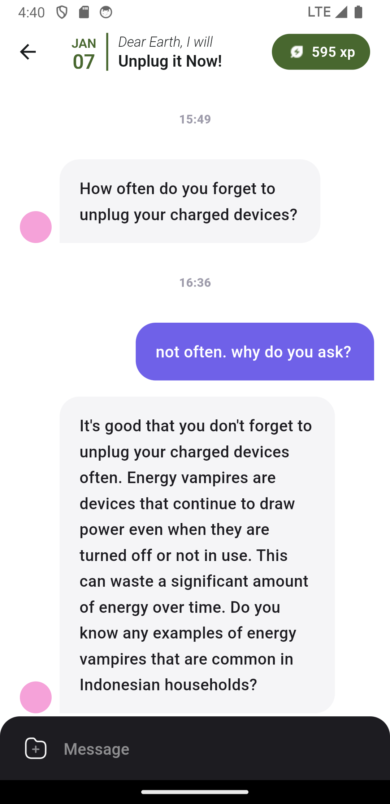
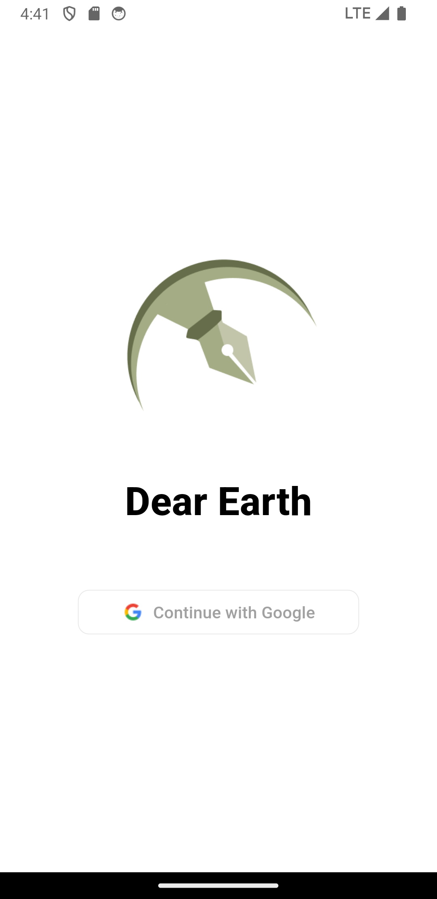
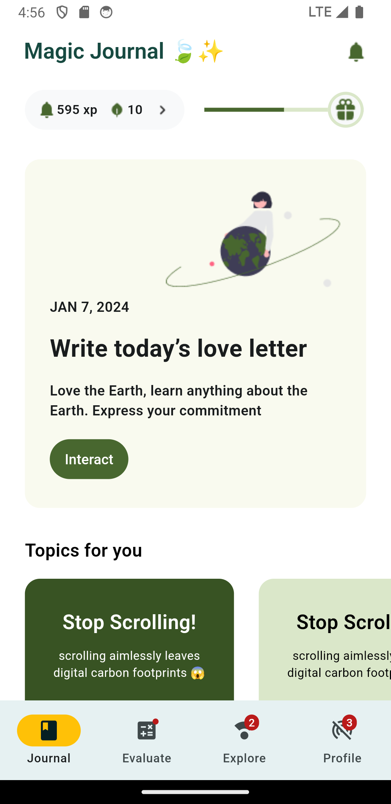
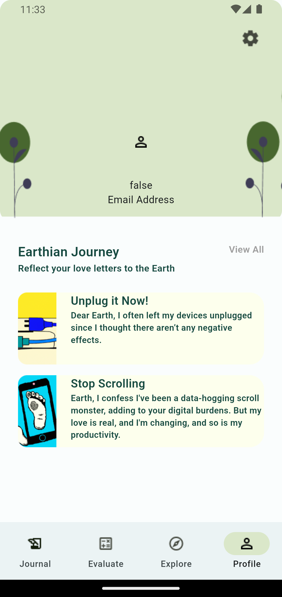
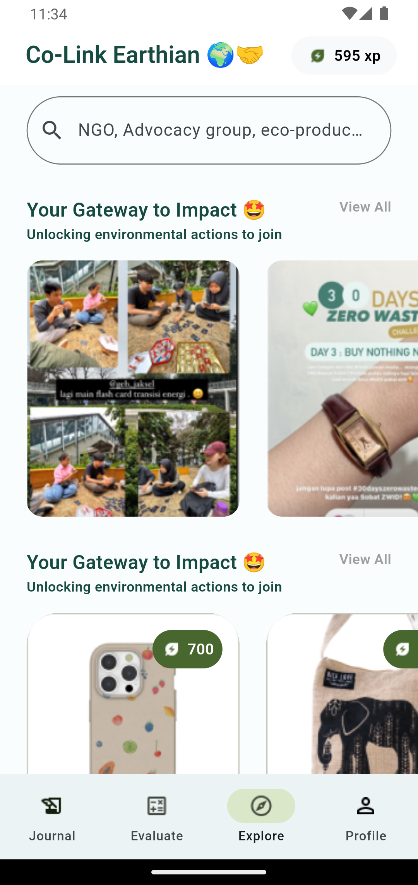
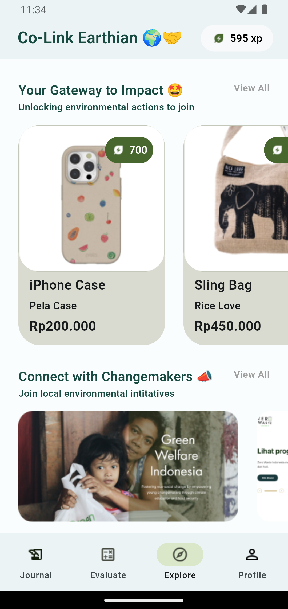
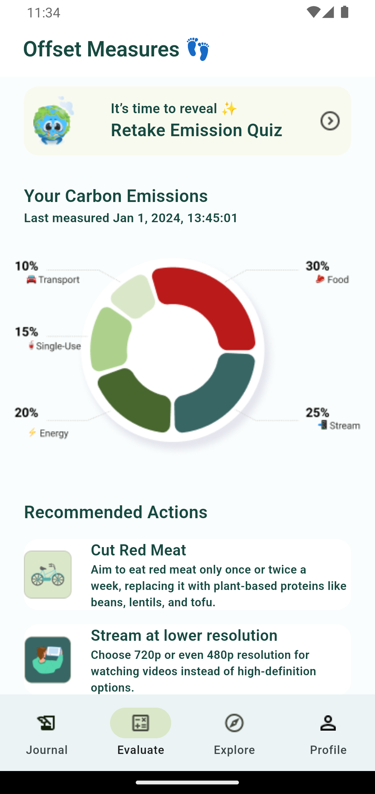
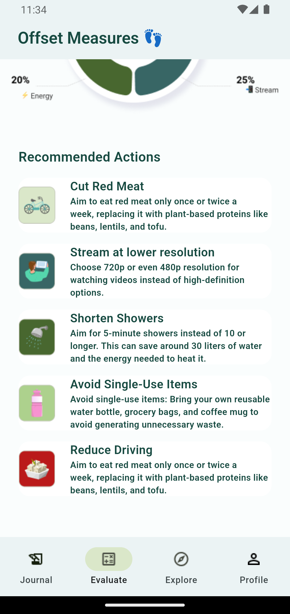
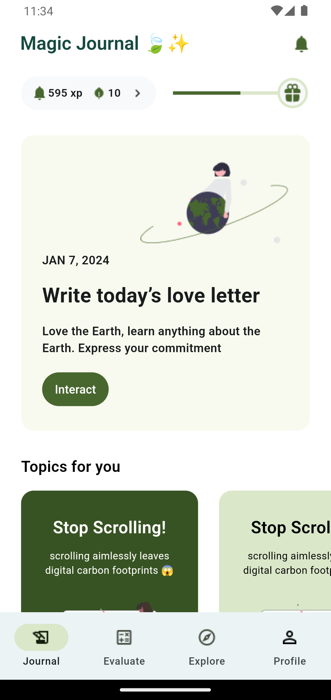

# Dear Earth

Dear Earth addresses the crucial need for engaging and effective climate education for Generation Z, the "digital natives." The climate is an active issue that develops rapidly and simply imparting knowledge is a limited approach. We recognize this and develop Dear Earth, a virtual climate literacy companion that leverages generative Artificial Intelligence (AI) to encourage and reward the user on their climate literacy and climate action journey. Dear Earth is like a virtual therapist: it reminds, motivates, and asks the right questions to empower you to inform yourself and take action. Dear Earth also offers a portal to relevant action opportunities, such as local campaigns, social work and sustainable products, for users to translate their climate literacy into meaningful contributions. Finally, Dear Earth enables users to reflect on their climate journey as a smart journal. This innovative approach directly aligns with the United Nations' Sustainable Development Goals (SDGs) 4 (Quality Education), 11 (Sustainable Cities and Communities), and 13 (Climate Action).

## Getting Started

This repository is a monorepo containing a Flutter app and a [PocketBase](https://github.com/pocketbase/pocketbase) configuration.

### Flutter app

You will need to have Flutter installed on your computer.

```bash
# flutter app directory
cd flutter-app/dearearth

# dependencies
flutter pub get

# run the app
flutter run
```

### PocketBase

PocketBase is used as the backend. The `pocketbase` directory contains migrations, hooks and a Dockerfile. In addition, there is a `docker-compose.yaml` file for running locally.

```bash
# pocketbase directory
cd pocketbase

# run via docker compose
docker compose up --build
```

## Team

- **Hipster:** Michelle Angela Aryanto (aryantomichelle@gmail.com)
- **Hustler:** Liu Fen Phaw (phawliufen9508@gmail.com)
- **Hacker:** Wen Sen Tan (wensentan2003@gmail.com)
- **Hacker:** Ahsan Imam Istamar (istamarahsan@gmail.com)

*created for GDSC HackFest 2024*

## Gallery



 
 
 
 
 
 
 
 